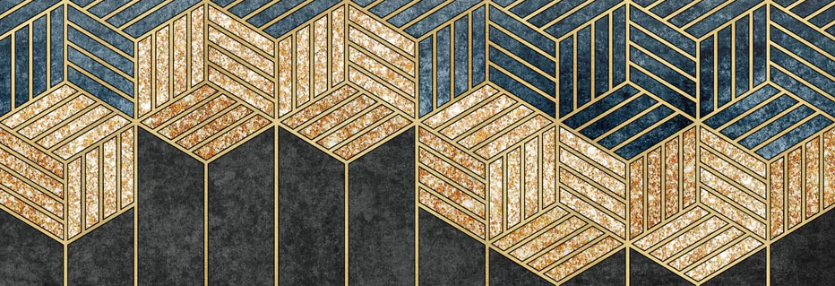

<h1>Welcome to my GitHub page 👋</h1> 

I'm Marine, PHP/JS fullstack web developper from Lyon area, France

 

<h2>📎 Technologies I use</h2>

  
  
  
  

<h2>✏️ Projects I am working on</h2>
<ul>
  <li>My resume: a website to introduce myself and expose visually my works</li>
  <li>Of courses: an website, firstly designed for mobiles, to make meals planning and shopping list easier</li>
</ul>
